# Final Project

-   [x] Read the [project requirements](https://vikramsinghmtl.github.io/420-5P6-Game-Programming/project/requirements).
-   [ ] Replace the sample proposal below with the one for your game idea.
-   [ ] Get the proposal greenlit by Vik.
-   [ ] Place any assets in `assets/` and remember to update `src/config.json`.
-   [ ] Decide on a height and width inside `src/globals.js`. The height and width will most likely be determined based on the size of the assets you find.
-   [ ] Start building the individual components of your game, constantly referring to the proposal you wrote to keep yourself on track.
-   [ ] Good luck, you got this!

---

# Neon Onslaught

## ✒️ Description

### Premise
In a neon-drenched cyberpunk arena, you are humanity's last defense against an endless robotic invasion. Armed with an arsenal of high-tech weapons and quick reflexes, you must survive increasingly brutal waves of hostile drones, tanks, and mechanical monstrosities. Between each wave, you'll upgrade your loadout, unlock devastating abilities, and prepare for the chaos ahead. Can you survive all 20 waves and defeat the final boss?

### Genre
Top-down wave-based shooter with roguelite progression elements, resource management, and arena combat mechanics.

### Control Scheme
- **W/A/S/D**: Move player
- **Mouse**: Aim weapon
- **Left Click**: Shoot primary weapon
- **Right Click**: Use secondary ability (grenade, shield, etc.)
- **1-6 Keys**: Switch between unlocked weapons
- **Space**: Dash ability (quick dodge with invincibility frames)
- **E**: Interact with shop/pickups
- **Shift**: Sprint (drains stamina bar)
- **ESC**: Pause menu
- **M**: Mute/unmute sounds

### Gameplay
Players spawn in the center of a neon-lit arena and must survive 20 increasingly difficult waves of enemies. The game features a dual-phase loop that alternates between intense combat and strategic planning:

**Combat Phase**: 
- Enemies spawn in waves around the arena perimeter
- Players must eliminate all enemies to complete the wave
- Defeated enemies drop coins and power-ups (health, ammo, shields, temporary boosts)
- Players can build combo multipliers by defeating enemies in quick succession
- Environmental hazards (fire zones, electricity, acid pools) spawn periodically to increase difficulty
- Destructible cover provides temporary protection but degrades under fire

**Shop Phase**: 
- Activated automatically between waves
- Players spend earned coins on permanent upgrades (health, speed, damage)
- Purchase new weapons (shotgun, assault rifle, sniper, laser, rocket launcher)
- Buy secondary abilities (grenades, time slow, EMP blast, shield bubble)
- Unlock deployable utilities (auto-turrets, repair drones, shield generators)

**Wave Progression**:
- Every 5 waves (waves 5, 10, 15, 20) features a boss fight with unique attack patterns and multi-phase mechanics
- Special challenge waves appear periodically (Survival, Speed Run, Horde mode)
- Enemy difficulty scales with each wave (increased health, damage, speed, and spawn count)
- New enemy types are gradually introduced (basic drones → advanced enemies → elite units)

**Win Condition**: Survive all 20 waves and defeat the final boss

**Loss Condition**: Player health reaches zero

## 📃 Requirements

### Core Gameplay
1. The player shall move using W/A/S/D keys in 8 directions
2. The player shall aim their weapon using mouse position
3. The player shall shoot projectiles in the direction of the mouse cursor
4. The player shall dash using spacebar to avoid damage with brief invincibility
5. The player shall switch between unlocked weapons using number keys
6. The player shall collect coins dropped by defeated enemies
7. The player shall collect power-ups dropped by defeated enemies

### Wave System
8. The system shall spawn enemies in waves with increasing difficulty
9. The system shall track the current wave number (1-20)
10. The system shall spawn more enemies with each successive wave
11. The system shall introduce new enemy types as waves progress
12. The system shall trigger boss fights on waves 5, 10, 15, and 20
13. The system shall activate the shop phase when all enemies in a wave are defeated
14. The system shall display a wave completion bonus based on performance

### Enemy Behavior
15. Basic enemies shall chase the player using pathfinding
16. Tank enemies shall charge at the player when in range
17. Turret enemies shall remain stationary and shoot projectiles at the player
18. Splitter enemies shall break into smaller enemies upon death
19. Teleporter enemies shall blink to random positions near the player
20. Shielder enemies shall have regenerating shields that must be depleted first
21. Spawner enemies shall periodically create basic enemies
22. Elite enemies shall have enhanced stats and special attack patterns
23. Boss enemies shall have multiple attack phases and unique mechanics

### Shop & Upgrade System
24. The player shall enter the shop phase between waves
25. The player shall purchase new weapons using collected coins
26. The player shall upgrade player stats (max health, movement speed, damage multiplier)
27. The player shall buy secondary abilities (grenades, time slow, EMP, shields)
28. The player shall see prices for all items before purchasing
29. The system shall prevent purchases if the player has insufficient coins
30. The player shall exit the shop to begin the next wave

### Combat Mechanics
31. The player shall deal damage to enemies when projectiles collide
32. The player shall take damage when hit by enemy attacks or hazards
33. The player shall die when health reaches zero
34. The player shall see visual feedback for damage dealt (damage numbers, particles)
35. The player shall see visual feedback for damage taken (screen shake, red flash)
36. The player shall build combo multipliers for consecutive kills without getting hit
37. The player shall lose combo multiplier if no kills occur within the time limit
38. The system shall apply weapon-specific damage, fire rate, and projectile behavior

### Power-ups & Drops
39. The system shall spawn health packs that restore player HP
40. The system shall spawn ammo crates that restore weapon ammunition
41. The system shall spawn shield boosts that grant temporary overshield
42. The system shall spawn temporary power-ups (double damage, speed boost, coin magnet)
43. The system shall despawn power-ups after a set duration if not collected
44. The player shall collect power-ups by moving over them

### Collision Detection
45. The system shall detect collisions between player and enemies (AABB)
46. The system shall detect collisions between player projectiles and enemies
47. The system shall detect collisions between enemy projectiles and player
48. The system shall detect collisions between player and power-ups
49. The system shall detect collisions between projectiles and destructible cover
50. The system shall detect collisions between player and environmental hazards
51. The system shall use hitboxes for more precise collision detection

### Environmental Systems
52. The system shall spawn destructible cover objects in the arena
53. The system shall damage and destroy cover when hit by projectiles
54. The system shall spawn environmental hazards (fire, electricity, acid) during waves
55. The system shall damage the player when they enter hazard zones
56. The system shall spawn supply drops from the sky with random power-ups
57. The system shall provide teleport pads that warp the player across the arena

### Persistence & Progression
58. The system shall save the player's high score (highest wave reached) to local storage
59. The system shall save permanent upgrades purchased with special currency
60. The system shall track and save achievement progress
61. The system shall save player statistics (total kills, coins collected, bosses defeated)
62. The system shall allow the player to resume from a saved game state
63. The system shall persist unlocked weapons and arenas across sessions
64. The system shall maintain a leaderboard of top scores

### UI & HUD
65. The system shall display current player health on the HUD
66. The system shall display current wave number and enemy count remaining
67. The system shall display coins collected in the current run
68. The system shall display current weapon and ammo count
69. The system shall display active power-ups and their remaining duration
70. The system shall display combo multiplier and timer
71. The system shall display cooldown timers for abilities
72. The system shall show damage numbers floating from enemies when hit

### Audio & Visual Polish
73. The system shall play unique sound effects for each weapon type
74. The system shall play enemy death sounds (different per enemy type)
75. The system shall play power-up collection sounds
76. The system shall play UI interaction sounds (clicks, hovers)
77. The system shall play boss roar/entrance sounds
78. The system shall play background music that intensifies with wave progression
79. The system shall display particle effects for weapon fire, impacts, and explosions
80. The system shall shake the screen on explosions and heavy damage
81. The system shall display muzzle flashes when weapons fire
82. The system shall animate enemy death with particle explosions
83. The system shall tween UI elements for smooth transitions

### Win/Loss States
84. The system shall trigger victory state when the player defeats the wave 20 boss
85. The system shall trigger game over state when player health reaches zero
86. The system shall display final statistics (waves survived, enemies killed, coins collected)
87. The system shall allow the player to restart or return to main menu from end states

## 🤖 State Diagrams

### Game State Diagram


### Player State Diagram


### Enemy State Diagram


### Boss State Diagram


## 🗺️ Class Diagram

```mermaid
classDiagram
    %% Abstract Base Classes
    class Weapon {
        <<abstract>>
        #damage: number
        #fireRate: number
        #ammo: number
        #maxAmmo: number
        #projectileSpeed: number
        +shoot()*
        +reload()
        +canShoot(): boolean
    }
    
    class Enemy {
        <<abstract>>
        #health: number
        #maxHealth: number
        #speed: number
        #damage: number
        #coinValue: number
        +update()*
        +takeDamage(amount)
        +die()*
        +dropLoot()
    }
    
    class PowerUp {
        <<abstract>>
        #duration: number
        #despawnTimer: number
        +collect()*
        +update()
    }
    
    class Projectile {
        <<abstract>>
        #damage: number
        #speed: number
        #piercing: boolean
        +update()*
        +onHit()*
    }
    
    %% Weapon Implementations
    class Pistol {
        +shoot()
    }
    class Shotgun {
        +shoot()
    }
    class AssaultRifle {
        +shoot()
    }
    class Sniper {
        +shoot()
    }
    class Laser {
        +shoot()
    }
    class RocketLauncher {
        +shoot()
    }
    
    Weapon <|-- Pistol
    Weapon <|-- Shotgun
    Weapon <|-- AssaultRifle
    Weapon <|-- Sniper
    Weapon <|-- Laser
    Weapon <|-- RocketLauncher
    
    %% Enemy Implementations
    class BasicEnemy {
        <<abstract>>
    }
    class AdvancedEnemy {
        <<abstract>>
    }
    class Boss {
        #currentPhase: number
        +changePhase()
        +summonMinions()
    }
    
    Enemy <|-- BasicEnemy
    Enemy <|-- AdvancedEnemy
    Enemy <|-- Boss
    
    class Drone {
        +update()
        +die()
    }
    class Tank {
        +update()
        +die()
        +charge()
    }
    class Turret {
        +update()
        +die()
        +shoot()
    }
    
    BasicEnemy <|-- Drone
    BasicEnemy <|-- Tank
    BasicEnemy <|-- Turret
    
    class Splitter {
        +update()
        +die()
        +split()
    }
    class Teleporter {
        +update()
        +die()
        +teleport()
    }
    class Shielder {
        #shield: number
        +update()
        +die()
        +regenerateShield()
    }
    class Spawner {
        +update()
        +die()
        +spawnMinion()
    }
    class Elite {
        +update()
        +die()
        +specialAttack()
    }
    
    AdvancedEnemy <|-- Splitter
    AdvancedEnemy <|-- Teleporter
    AdvancedEnemy <|-- Shielder
    AdvancedEnemy <|-- Spawner
    AdvancedEnemy <|-- Elite
    
    %% PowerUp Implementations
    class HealthPack {
        +collect()
    }
    class AmmoCrate {
        +collect()
    }
    class ShieldBoost {
        +collect()
    }
    class TemporaryBoost {
        <<abstract>>
        #boostAmount: number
    }
    
    PowerUp <|-- HealthPack
    PowerUp <|-- AmmoCrate
    PowerUp <|-- ShieldBoost
    PowerUp <|-- TemporaryBoost
    
    class DoubleDamage {
        +collect()
    }
    class SpeedBoost {
        +collect()
    }
    class CoinMagnet {
        +collect()
    }
    
    TemporaryBoost <|-- DoubleDamage
    TemporaryBoost <|-- SpeedBoost
    TemporaryBoost <|-- CoinMagnet
    
    %% Projectile Implementations
    class Bullet {
        +update()
        +onHit()
    }
    class Rocket {
        +update()
        +onHit()
        +explode()
    }
    class LaserBeam {
        +update()
        +onHit()
    }
    class EnemyProjectile {
        +update()
        +onHit()
    }
    
    Projectile <|-- Bullet
    Projectile <|-- Rocket
    Projectile <|-- LaserBeam
    Projectile <|-- EnemyProjectile
    
    %% Factory Classes
    class WeaponFactory {
        <<factory>>
        +createWeapon(type): Weapon
    }
    
    class EnemyFactory {
        <<factory>>
        +createEnemy(type, wave): Enemy
        +spawnWave(waveNumber): Enemy[]
    }
    
    class PowerUpFactory {
        <<factory>>
        +createPowerUp(type): PowerUp
        +createRandomPowerUp(): PowerUp
    }
    
    class ProjectileFactory {
        <<factory>>
        +createProjectile(type, x, y, angle): Projectile
    }
    
    class ParticleFactory {
        <<factory>>
        +createExplosion(x, y)
        +createMuzzleFlash(x, y, angle)
        +createImpact(x, y)
        +createDamageNumber(x, y, damage)
    }
    
    WeaponFactory --> Weapon: creates
    EnemyFactory --> Enemy: creates
    PowerUpFactory --> PowerUp: creates
    ProjectileFactory --> Projectile: creates
    
    %% Game Entities
    class Player {
        -health: number
        -maxHealth: number
        -shield: number
        -speed: number
        -coins: number
        -currentWeapon: Weapon
        -weapons: Weapon[]
        -activeBoosts: PowerUp[]
        -combo: number
        +update()
        +move()
        +shoot()
        +dash()
        +switchWeapon(index)
        +takeDamage(amount)
        +collectPowerUp(powerUp)
        +collectCoin(value)
    }
    
    class WaveManager {
        -currentWave: number
        -enemiesRemaining: number
        -enemySpawnTimer: number
        -difficultyMultiplier: number
        +startWave()
        +spawnEnemies()
        +checkWaveComplete(): boolean
        +getWaveDifficulty(): number
    }
    
    class Shop {
        -weaponPrices: Map
        -upgradePrices: Map
        -abilityPrices: Map
        +purchaseWeapon(type): boolean
        +purchaseUpgrade(type): boolean
        +purchaseAbility(type): boolean
        +canAfford(price): boolean
    }
    
    class Arena {
        -coverObjects: GameObject[]
        -hazardZones: GameObject[]
        -teleportPads: GameObject[]
        +spawnCover()
        +spawnHazard()
        +updateHazards()
        +checkCollisions()
    }
    
    class ComboSystem {
        -comboCount: number
        -comboTimer: number
        -multiplier: number
        +addKill()
        +resetCombo()
        +update()
        +getMultiplier(): number
    }
    
    %% Relationships
    Player --> Weapon: has 1..*
    Player --> PowerUp: has 0..*
    WaveManager --> Enemy: manages *
    WaveManager --> EnemyFactory: uses
    Player --> ProjectileFactory: uses
    Arena --> GameObject: contains *
    Player --> ComboSystem: has 1
```



## 🧵 Wireframes

### Title Screen
```
╔════════════════════════════════════════════════════════╗
║                                                        ║
║                  ███╗   ██╗███████╗ ██████╗ ███╗   ██╗║
║                  ████╗  ██║██╔════╝██╔═══██╗████╗  ██║║
║                  ██╔██╗ ██║█████╗  ██║   ██║██╔██╗ ██║║
║                  ██║╚██╗██║██╔══╝  ██║   ██║██║╚██╗██║║
║                  ██║ ╚████║███████╗╚██████╔╝██║ ╚████║║
║                  ╚═╝  ╚═══╝╚══════╝ ╚═════╝ ╚═╝  ╚═══╝║
║                                                        ║
║                 ██████╗ ███╗   ██╗███████╗██╗          ║
║                ██╔═══██╗████╗  ██║██╔════╝██║          ║
║                ██║   ██║██╔██╗ ██║███████╗██║          ║
║                ██║   ██║██║╚██╗██║╚════██║██║          ║
║                ╚██████╔╝██║ ╚████║███████║███████╗     ║
║                 ╚═════╝ ╚═╝  ╚═══╝╚══════╝╚══════╝     ║
║              ┌─────────────────────────────────┐       ║
║              │  ▶  PLAY GAME                   │       ║
║              ├─────────────────────────────────┤       ║
║              │  📖  INSTRUCTIONS               │       ║
║              ├─────────────────────────────────┤       ║
║              │  ⬆  PERMANENT UPGRADES          │       ║
║              ├─────────────────────────────────┤       ║
║              │  🏆  LEADERBOARD                │       ║
║              ├─────────────────────────────────┤       ║
║              │  ⚙  SETTINGS                    │       ║
║              └─────────────────────────────────┘       ║
║                                                        ║
║  High Score: Wave 15          Enemies Killed: 2,543   ║
╚════════════════════════════════════════════════════════╝
```

### Instructions Screen
```
╔════════════════════════════════════════════════════════╗
║  ← BACK                   INSTRUCTIONS                 ║
╠════════════════════════════════════════════════════════╣
║                                                        ║
║  CONTROLS:                                             ║
║  ┌─────────────────────────────────────────────────┐  ║
║  │  W/A/S/D        Move                            │  ║
║  │  Mouse          Aim                             │  ║
║  │  Left Click     Shoot                           │  ║
║  │  Right Click    Secondary Ability               │  ║
║  │  Space          Dash (invincible)               │  ║
║  │  1-6            Switch Weapons                  │  ║
║  │  Shift          Sprint                          │  ║
║  │  E              Interact                        │  ║
║  │  ESC            Pause                           │  ║
║  └─────────────────────────────────────────────────┘  ║
║                                                        ║
║  OBJECTIVE:                                            ║
║  • Survive 20 waves of increasingly difficult enemies ║
║  • Collect coins and power-ups from defeated enemies  ║
║  • Purchase weapons and upgrades between waves        ║
║  • Defeat bosses on waves 5, 10, 15, and 20          ║
║                                                        ║
║  TIPS:                                                 ║
║  • Build combos by defeating enemies quickly          ║
║  • Use dash to dodge through enemy attacks            ║
║  • Destructible cover can save your life              ║
║  • Different weapons are effective against different  ║
║    enemy types                                         ║
║                                                        ║
║              [PRESS ANY KEY TO CONTINUE]               ║
╚════════════════════════════════════════════════════════╝
```

### Game Screen (Combat Phase)
```
╔════════════════════════════════════════════════════════╗
║ HP: ████████░░ 80/100    Wave: 7/20    Enemies: 12/25 ║
║ Shield: ███░░░░░░░ 30    Combo: x5 [▓▓▓▓░░░░░░]       ║
║ Coins: 450 💰            Weapon: ASSAULT RIFLE [24/30] ║
╠════════════════════════════════════════════════════════╣
║                                                        ║
║         🔥                   👾                        ║
║                  👾                                    ║
║                         🛡️                            ║
║    👾                                   👾             ║
║              ⚡    📦                                   ║
║                         😎 ← PLAYER                   ║
║                        ╱ ╲                            ║
║         👾            ═══╪═══                          ║
║                        ╱ ╲                            ║
║                                 👾                     ║
║    💊                                      🔥          ║
║                 👾                                     ║
║                              👾                        ║
║         👾                              👾             ║
║                                                        ║
╠════════════════════════════════════════════════════════╣
║ Active Boosts: [⚡SPEED x1.5] [💪DAMAGE x2.0]          ║
║ Abilities: [💣 READY] [⏰ 3s] [🛡️ 15s]                ║
╚════════════════════════════════════════════════════════╝

Legend:
😎 = Player
👾 = Enemies (various types)
🔥 = Fire Hazard
⚡ = Electricity Hazard
💊 = Health Pack
📦 = Ammo Crate
🛡️ = Shield Boost
```

### Shop Screen (Between Waves)
```
╔════════════════════════════════════════════════════════╗
║                    WAVE 7 COMPLETE!                    ║
║              Enemies Killed: 25    Bonus: +100 💰      ║
║                  Your Coins: 550 💰                     ║
╠════════════════════════════════════════════════════════╣
║                                                        ║
║  WEAPONS:                          UPGRADES:           ║
║  ┌──────────────────────────┐    ┌──────────────────┐ ║
║  │ 🔫 SHOTGUN      200💰    │    │ ❤️  Max Health   │ ║
║  │    [PURCHASE]            │    │    +20    150💰  │ ║
║  ├──────────────────────────┤    │    [PURCHASE]    │ ║
║  │ 🎯 SNIPER       300💰    │    ├──────────────────┤ ║
║  │    [LOCKED]              │    │ 👟 Move Speed    │ ║
║  ├──────────────────────────┤    │    +10%   100💰  │ ║
║  │ ⚡ LASER         400💰    │    │    [PURCHASE]    │ ║
║  │    [LOCKED]              │    ├──────────────────┤ ║
║  └──────────────────────────┘    │ 💪 Damage        │ ║
║                                   │    +15%   200💰  │ ║
║  ABILITIES:                       │    [PURCHASE]    │ ║
║  ┌──────────────────────────┐    └──────────────────┘ ║
║  │ 💣 GRENADE      150💰    │                         ║
║  │    [OWNED]               │    UTILITIES:           ║
║  ├──────────────────────────┤    ┌──────────────────┐ ║
║  │ ⏰ TIME SLOW    250💰    │    │ 🔧 AUTO-TURRET   │ ║
║  │    [PURCHASE]            │    │    250💰         │ ║
║  ├──────────────────────────┤    │    [PURCHASE]    │ ║
║  │ 🛡️  SHIELD      200💰    │    └──────────────────┘ ║
║  │    [PURCHASE]            │                         ║
║  └──────────────────────────┘                         ║
║                                                        ║
║          [READY FOR NEXT WAVE] ─────────────>         ║
╚════════════════════════════════════════════════════════╝
```

### Boss Fight Screen
```
╔════════════════════════════════════════════════════════╗
║ HP: ██████░░░░ 60/100           ⚠️  BOSS WAVE  ⚠️      ║
║ Shield: ████░░░░░░ 40/100                              ║
║ Combo: x12 [▓▓▓▓▓▓▓▓░░] Timer: 4s                     ║
╠════════════════════════════════════════════════════════╣
║                                                        ║
║              CYBERNETIC DESTROYER                      ║
║         ████████████████████░░░░░░░░░░ 2400/3000      ║
║                     PHASE 2                            ║
║                                                        ║
║                      ╔═══╗                             ║
║                      ║👁👁║                            ║
║                   ╔══╩═══╩══╗                          ║
║         👾        ║  BOSS  ║        👾                 ║
║                   ║ ▓▓▓▓▓▓ ║                           ║
║                   ╚═╦═══╦═╝                            ║
║      👾            ║   ║            👾                 ║
║           💥      ══   ══       💥                     ║
║                    💥  💥                               ║
║                                                        ║
║              😎 ← PLAYER                               ║
║             ╱ ╲                                        ║
║            ═══╪═══                                     ║
║             ╱ ╲                                        ║
║                                                        ║
║  [BOSS ABILITY: MISSILE BARRAGE - DODGE!]             ║
╚════════════════════════════════════════════════════════╝
```

### Victory Screen
```
╔════════════════════════════════════════════════════════╗
║                                                        ║
║                  🎉 VICTORY! 🎉                        ║
║                                                        ║
║         You survived all 20 waves and defeated         ║
║              the Cybernetic Destroyer!                 ║
║                                                        ║
║  ┌──────────────────────────────────────────────────┐ ║
║  │                 FINAL STATS                      │ ║
║  ├──────────────────────────────────────────────────┤ ║
║  │  Waves Survived:              20                 │ ║
║  │  Total Enemies Killed:        487                │ ║
║  │  Bosses Defeated:             4                  │ ║
║  │  Coins Collected:             8,250              │ ║
║  │  Highest Combo:               x28                │ ║
║  │  Accuracy:                    73%                │ ║
║  │  Time Played:                 34:52              │ ║
║  │                                                  │ ║
║  │  SCORE:                       52,480             │ ║
║  │  ★ NEW HIGH SCORE! ★                            │ ║
║  └──────────────────────────────────────────────────┘ ║
║                                                        ║
║         Permanent Currency Earned: 500 🏆             ║
║                                                        ║
║              [PLAY AGAIN]  [MAIN MENU]                 ║
╚════════════════════════════════════════════════════════╝
```

### Game Over Screen
```
╔════════════════════════════════════════════════════════╗
║                                                        ║
║                   💀 GAME OVER 💀                      ║
║                                                        ║
║              You were destroyed on Wave 12             ║
║                                                        ║
║  ┌──────────────────────────────────────────────────┐ ║
║  │                    STATS                         │ ║
║  ├──────────────────────────────────────────────────┤ ║
║  │  Waves Survived:              11                 │ ║
║  │  Total Enemies Killed:        234                │ ║
║  │  Bosses Defeated:             2                  │ ║
║  │  Coins Collected:             3,120              │ ║
║  │  Highest Combo:               x15                │ ║
║  │  Time Played:                 18:23              │ ║
║  │                                                  │ ║
║  │  SCORE:                       18,960             │ ║
║  └──────────────────────────────────────────────────┘ ║
║                                                        ║
║         Permanent Currency Earned: 156 🏆             ║
║                                                        ║
║                [RETRY]  [MAIN MENU]                    ║
╚════════════════════════════════════════════════════════╝
```

## 🎨 Assets

### Visual Style
We're going for a **neon cyberpunk aesthetic** with:
- Dark backgrounds (deep purples, blacks)
- Bright neon accents (cyan, magenta, yellow, green)
- Geometric enemy designs with glowing outlines
- Particle effects for all combat interactions
- Smooth UI with futuristic fonts

### Asset Sources

#### 🖼️ Images / Sprites
- **Player Character**: Top-down spaceship or armored soldier sprite
  - Source: [itch.io - Top Down Shooter Pack](https://itch.io/game-assets/tag-top-down-shooter)
  - Alternative: [OpenGameArt - Space Ships](https://opengameart.org/art-search?keys=spaceship+top+down)
  
- **Enemies**: Geometric robots and drones with neon effects
  - Source: [itch.io - Cyberpunk Enemies](https://itch.io/game-assets/tag-cyberpunk)
  - Source: [Kenney.nl - Top Down Shooter Pack](https://kenney.nl/assets/topdown-shooter)
  
- **Weapons**: Futuristic gun sprites (pistol, shotgun, rifle, sniper, laser, rocket)
  - Source: [itch.io - Weapon Sprites](https://itch.io/game-assets/tag-weapons)
  - Source: [OpenGameArt - Weapons](https://opengameart.org/art-search?keys=weapons)
  
- **Projectiles & Effects**: Bullets, lasers, explosions, particles
  - Source: [itch.io - Particle Effects](https://itch.io/game-assets/tag-particles)
  - Source: [OpenGameArt - Effects](https://opengameart.org/art-search?keys=explosion+effect)
  
- **Power-ups**: Health packs, ammo crates, shield icons, boost icons
  - Source: [Kenney.nl - Game Icons](https://kenney.nl/assets/game-icons)
  
- **UI Elements**: Buttons, health bars, panels, icons
  - Source: [Kenney.nl - UI Pack](https://kenney.nl/assets/ui-pack)
  - Source: [itch.io - UI Assets](https://itch.io/game-assets/tag-ui)
  
- **Arena Background**: Neon grid floor, cyberpunk cityscape backdrop
  - Source: [itch.io - Cyberpunk Backgrounds](https://itch.io/game-assets/tag-cyberpunk)

#### ✏️ Fonts
- **Title Font**: Bold, futuristic display font
  - [Orbitron](https://fonts.google.com/specimen/Orbitron) - Geometric sci-fi font
  - [Audiowide](https://fonts.google.com/specimen/Audiowide) - Technology-themed font
  
- **UI Font**: Clean, readable sans-serif
  - [Roboto](https://fonts.google.com/specimen/Roboto) - Modern, legible
  - [Exo 2](https://fonts.google.com/specimen/Exo+2) - Futuristic but readable
  
- **Numbers Font**: Monospace for scores and stats
  - [Roboto Mono](https://fonts.google.com/specimen/Roboto+Mono) - Clean monospace
  - [Share Tech Mono](https://fonts.google.com/specimen/Share+Tech+Mono) - Tech-style monospace

#### 🔊 Sounds & Music

**Weapon Sounds**:
- Pistol fire: [freesound.org - Pistol Shot](https://freesound.org/search/?q=pistol+shot)
- Shotgun fire: [freesound.org - Shotgun](https://freesound.org/search/?q=shotgun)
- Assault rifle fire: [freesound.org - Rifle](https://freesound.org/search/?q=assault+rifle)
- Sniper shot: [freesound.org - Sniper](https://freesound.org/search/?q=sniper+shot)
- Laser beam: [freesound.org - Laser](https://freesound.org/search/?q=laser+beam)
- Rocket launch: [freesound.org - Rocket](https://freesound.org/search/?q=rocket+launch)

**Combat Sounds**:
- Explosion: [freesound.org - Explosion](https://freesound.org/search/?q=explosion)
- Enemy death: [freesound.org - Robot Death](https://freesound.org/search/?q=robot+death)
- Player hit: [freesound.org - Impact](https://freesound.org/search/?q=hit+impact)
- Shield break: [freesound.org - Glass Break](https://freesound.org/search/?q=shield+break)

**UI Sounds**:
- Button click: [freesound.org - Click](https://freesound.org/search/?q=ui+click)
- Button hover: [freesound.org - Hover](https://freesound.org/search/?q=ui+hover)
- Purchase success: [freesound.org - Success](https://freesound.org/search/?q=success+sound)
- Purchase fail: [freesound.org - Error](https://freesound.org/search/?q=error+beep)

**Pickup Sounds**:
- Coin collect: [freesound.org - Coin](https://freesound.org/search/?q=coin+pickup)
- Health pickup: [freesound.org - Heal](https://freesound.org/search/?q=health+restore)
- Power-up collect: [freesound.org - Powerup](https://freesound.org/search/?q=powerup)

**Ambience & Music**:
- Background music (combat): [OpenGameArt - Cyberpunk Music](https://opengameart.org/art-search?keys=cyberpunk+music)
- Background music (shop): [OpenGameArt - Menu Music](https://opengameart.org/art-search?keys=menu+music)
- Boss theme: [freesound.org - Epic Music](https://freesound.org/search/?q=boss+music)
- Victory fanfare: [freesound.org - Victory](https://freesound.org/search/?q=victory+fanfare)

**Alternative Music Sources**:
- [incompetech.com](https://incompetech.com/) - Royalty-free music by Kevin MacLeod
- [itch.io - Music Assets](https://itch.io/game-assets/tag-music)

### Attribution
All assets will be properly credited in the `src/main.js` file header comments, including:
- Asset name
- Creator name
- Source URL
- License type

Example:
```javascript
/**
 * Neon Onslaught
 * 
 * Assets:
 * - Player Sprite: "Spaceship" by Kenney (kenney.nl) - CC0
 * - Enemy Sprites: "Robot Pack" by Author (itch.io/link) - CC-BY
 * - Weapon Sounds: freesound.org (various authors) - CC0
 * - UI Font: "Orbitron" by Google Fonts - OFL
 * - Background Music: "Cyber Chase" by Kevin MacLeod (incompetech.com) - CC-BY
 */
```

## 🛠️ Technical Implementation Details

### Canvas Dimensions
Based on typical top-down shooter assets, we'll use:
- **Width**: 1280px
- **Height**: 720px (16:9 aspect ratio)
- Camera system to keep player centered during movement

### Libraries & Tools
We'll be using the provided game engine libraries from the `/lib` folder:
- `Animation.js` - Sprite sheet animation system
- `Hitbox.js` - Precise collision detection
- `Timer.js` - Tween animations and delayed callbacks
- `StateMachine.js` - Game and entity state management
- `SoundPool.js` - Audio management
- `Sprite.js` - Sprite rendering

### External Libraries (if needed)
- **No additional libraries required** - using the provided game engine

### Particle System
We'll implement a custom particle system for:
- Explosion effects (expanding circles with fading alpha)
- Muzzle flashes (directional bursts)
- Impact sparks (small bouncing particles)
- Damage numbers (floating text with fade-out)
- Trail effects for projectiles

### Pathfinding
Enemy AI will use simple chase behavior:
- Calculate vector from enemy to player
- Normalize and multiply by enemy speed
- Add obstacle avoidance using raycasting
- Boss enemies use predefined pattern systems

### Procedural Wave Generation
The `WaveManager` will use algorithms to:
- Scale enemy count: `baseCount + (wave * 2)`
- Scale enemy stats: `baseStat * (1 + wave * 0.15)`
- Introduce new enemy types based on wave thresholds
- Generate random enemy compositions within difficulty budget

### Save System Structure
localStorage will store:
```javascript
{
  highScore: { wave: 15, score: 45000 },
  permanentUpgrades: {
    maxHealthBonus: 40,
    damageBonus: 0.25,
    speedBonus: 0.15
  },
  unlockedWeapons: ['pistol', 'shotgun', 'assault_rifle'],
  unlockedArenas: ['factory', 'wasteland'],
  achievements: [
    { id: 'first_boss', unlocked: true },
    { id: 'wave_10', unlocked: true }
  ],
  totalStats: {
    totalKills: 5482,
    totalCoins: 45000,
    bossesDefeated: 6,
    gamesPlayed: 23
  }
}
```

### Performance Optimization
- Object pooling for projectiles and particles (reuse instead of create/destroy)
- Spatial partitioning for collision detection (grid-based bucketing)
- Render only entities within camera bounds + buffer
- Limit max particle count (despawn oldest if exceeding limit)
- Use requestAnimationFrame for smooth 60 FPS gameplay

## 📚 Development Workflow

### Git Branching Strategy
We'll use feature branches for development:
- `main` - Stable, working code only
- `feature/player-system` - Player movement, shooting, abilities
- `feature/weapon-system` - All weapon types and projectiles
- `feature/enemy-ai` - Enemy behaviors and state machines
- `feature/wave-manager` - Wave spawning and progression
- `feature/shop-system` - Shop UI and upgrade purchases
- `feature/boss-fights` - Boss mechanics and patterns
- `feature/powerup-system` - Collectibles and temporary boosts
- `feature/ui-hud` - In-game interface and menus
- `feature/audio-juice` - Sounds, music, and visual effects
- `feature/persistence` - Save/load system

### Commit Message Convention
- `feat: add player dash ability with invincibility frames`
- `fix: resolve collision bug with destructible cover`
- `refactor: extract enemy pathfinding into separate class`
- `style: add particle effects to weapon fire`
- `docs: update README with boss attack patterns`

### Division of Labor

**Person 1 (Player & Systems)**:
- Player entity (movement, shooting, dash, state machine)
- Weapon system + WeaponFactory
- Projectile system + ProjectileFactory
- Shop state and upgrade purchasing
- UI/HUD rendering
- Input handling

**Person 2 (Enemies & World)**:
- Enemy entities (all types) + state machines
- EnemyFactory + AI behaviors
- WaveManager + difficulty scaling
- Boss fights + attack patterns
- PowerUp system + PowerUpFactory
- Arena hazards and environmental systems

**Shared Responsibilities**:
- State machine setup (game states)
- Collision detection system
- Particle effects (ParticleFactory)
- Sound integration
- localStorage persistence
- Testing and balancing
- Bug fixes and polish

### Testing Plan
- Test each weapon type against each enemy type
- Verify collision detection accuracy with hitboxes
- Balance testing: ensure waves are challenging but fair
- Performance testing: maintain 60 FPS with max enemy count
- Save/load testing: verify data persists correctly
- Input testing: test all control combinations
- Edge case testing: player death during dash, boss phase transitions, etc.

## 🎯 Success Criteria

This project will be considered successful if:
1. All 87 requirements are implemented and functional
2. Game runs smoothly at 60 FPS with no major bugs
3. State machines properly control game flow and entity behaviors
4. Inheritance and polymorphism are demonstrated throughout the codebase
5. Factory pattern is used for all major entity creation
6. Collision detection works accurately and fairly
7. Persistence system saves and loads data correctly
8. Win/loss conditions trigger appropriate end states
9. Visual and audio polish creates an engaging experience
10. Git history shows consistent, meaningful commits with feature branches
11. All assets are properly attributed
12. Code is clean, well-organized, and follows OOP principles

---

## 📝 Notes

- This proposal is subject to iteration based on instructor feedback
- Feature scope may be adjusted during implementation if time constraints arise
- We're aiming for quality over quantity - better to have polished core mechanics than rushed features
- Playtesting with peers will help us balance difficulty and tune gameplay
- We'll prioritize the core gameplay loop (combat → shop → combat) before adding advanced features

**Team Members**: [Your Name] & [Partner Name]

**Estimated Completion Timeline**:
- Week 1 (Dec 1-7): Core player + enemy systems, basic shooting
- Week 2 (Dec 8-14): Wave manager, shop, UI, polish & testing

---

*Let's survive the Neon Onslaught!* 🎮⚡
